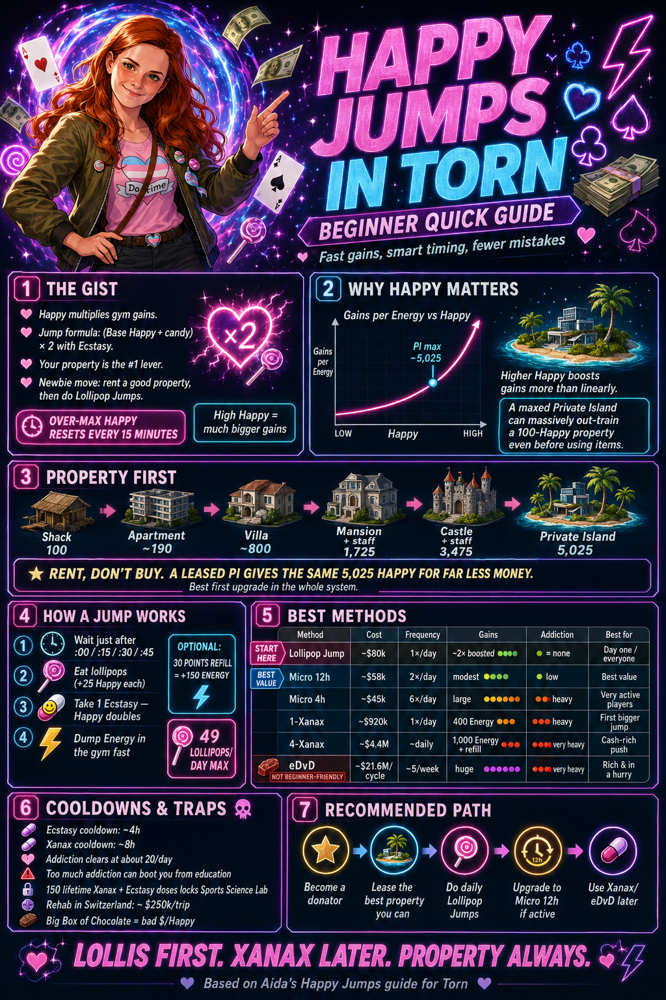

# 🍭 Torn Happy Jumps — a beginner's guide

A free, no-fluff guide to **happy-jump training in [Torn](https://www.torn.com/)**, aimed at new players. Every jump explained step by step, with **live market prices**, **addiction** costs, and a full comparison of every method — all backed by a minute-by-minute simulator checked against the live Torn API.

### 👉 Read it: **https://aidapaul.github.io/torn-happy-jumps/**

- 💬 Feedback / upvotes: [the forum thread](https://www.torn.com/forums.php#/p=threads&f=61&t=16578875&b=0&a=0)

---

---

**The short version:** Happy is your gains multiplier. Train at high Happy and the same Energy gives a lot more stat. Lollipops beat chocolate by ~47× value, cheap-and-steady jumps beat occasional splurges by ~21× per dollar, and a daily Lollipop Jump is addiction-neutral. **Lollis first. Xanax later. Property always.**

Built by [Aida [4294353]](https://www.torn.com/profiles.php?XID=4294353).
